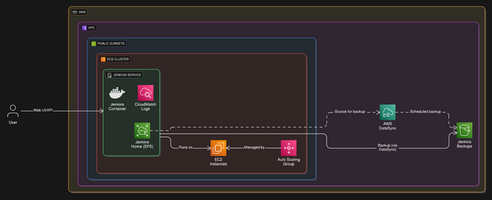

<!-- @format -->

# Jenkins on AWS ECS Using Terraform (Highly Available Setup)

This Terraform module sets up a robust Jenkins infrastructure in AWS, including security groups, ECS task definitions, EFS for persistent storage, and other supporting components. It is designed to be flexible, allowing users to override defaults and customize the deployment while providing sensible defaults for common use cases.

---

## Why Use This Module?

Managing Jenkins on AWS can be complex — this module simplifies it with:

- A fully containerized setup on ECS
- Persistent and shareable EFS storage
- Automated backup to S3 using DataSync
- CloudWatch-based centralized logging
- Automatic Jenkins plugin management
- Complete customization via Terraform variables

**Whether you're setting up a small CI/CD instance or scaling Jenkins in production, this module gives you flexibility and infrastructure as code.**

## What's Included

| Component             | Purpose                                 |
|-----------------------|-----------------------------------------|
| ECS Cluster           | Hosts the Jenkins container             |
| ECS Task Definition   | Defines Jenkins container config        |
| EFS File System       | Persistent Jenkins home directory       |
| CloudWatch Logs       | Streams container logs                  |
| S3 + DataSync         | Optional backup of Jenkins data         |
| IAM Roles             | Secure access to AWS services           |
| Security Groups       | VPC traffic rules for Jenkins           |

## Key Features of This Jenkins on ECS Module

- **Jenkins Deployment:**
  - Deploy Jenkins as a containerized service on ECS.
  - Configure Jenkins with customizable plugins.
  - Always get the latest version of Jenkins.
  - Plugins are automatically updated during `terraform apply` if `enable_update_plugins` is set to `true`.

- **Networking:**
  - Predefined security groups for ingress/egress rules.
  - Support for adding additional security groups.
  - Allows traffic to flow within your VPC based on CIDR subnet configuration.

- **Persistent Storage:**
  - Automatically provisions an EFS file system for Jenkins data.
  - If the master container goes down, ECS will automatically bring up another container, and jobs will resume from the point where Jenkins went down.

- **CloudWatch Integration:**
  - Logs are forwarded to CloudWatch with customizable retention periods.

- **Customization:**
  - All major settings, such as instance sizes, security rules, and Jenkins configurations, can be overridden.

- **Backup:**
  - Backup Jenkins data from EFS to S3 using AWS DataSync, scheduled with a configurable cron expression.

---
## Automatic Jenkins Plugin Updates
 - In order for automatic plugings update to work need to set `enable_update_plugins` to `true` by default it is set to `false`.
 - The Jenkins should be reacble using your own DNS to resolve `jenkins_url` if using Loadbalancer its target group should point to the instance runnig on ECS cluster.

---

## Pre-requiset
- Docker 
- Java runtime
- Terraform

## Jenkins Configuration Tips

- **Job Execution on Master and Slaves:**
  - By default, all Jenkins jobs will run on the Master node. To enable jobs to run on dynamically provisioned slaves, you need to download and configure the **Amazon Elastic Container Service (ECS) / Fargate** [Amazon Elastic Container Service (ECS) / Fargate)](https://plugins.jenkins.io/amazon-ecs/) on Jenkins.
  - After installing the plugin, navigate to `Manage Jenkins` and select the `Clouds` section. 
  - Create a new cloud configuration and set it up according to your requirements.


- **Accessing Jenkins Without DNS:**
  - If you do not have a DNS configured, you can access Jenkins manually:
    1. Log in to the AWS Management Console.
    2. Navigate to the **ECS** section and locate the `jenkins_cpu` cluster.
    3. Select the running task and go to the **Networking** tab.
    4. Click on the **Public IP** of the associated EC2 instance and append port `8080` to the URL (e.g., `http://<Public-IP>:8080`).

---
# Resources

| Category                               | Type     |
|----------------------------------------|----------|
| aws_security_group                     | Resource |
| null_resource                          | Resource |
| aws_iam_role                           | Resource |
| aws_iam_role_policy_attachment         | Resource |
| aws_iam_instance_profile               | Resource |
| aws_efs_file_system                    | Resource |
| aws_efs_mount_target                   | Resource |
| aws_ecs_task_definition                | Resource |
| aws_ecs_service                        | Resource |
| aws_ecs_cluster                        | Resource |
| aws_ecs_cluster_capacity_providers     | Resource |
| aws_ecs_capacity_provider              | Resource |
| aws_autoscaling_group                  | Resource |
| aws_launch_template                    | Resource |
| aws_cloudwatch_log_group               | Resource |
| aws_s3_bucket                          | Resource |
| random_id                              | Resource |
| aws_region                             | Data     |
| docker_registry_image                  | Data     |
| aws_subnets                            | Data     |
| aws_subnet                             | Data     |
| aws_vpc                                | Data     |
| aws_ssm_parameter                      | Data     |
| aws_iam_policy_document                | Data     |
| aws_iam_policy                         | Data     |


# Modules

| Module Name     | Purpose                                          |
|-----------------|--------------------------------------------------|
| `backup_tasks`  | Handles DataSync job setup for EFS to S3 backups |
| `efs_location`  | Creates the EFS location needed for DataSync     |
| `s3_location`   | Configures the S3 location for backup            |

# Input

| Name                        | Description                                            | Type                  | Default                       | Required |
|-----------------------------|--------------------------------------------------------|-----------------------|-------------------------------|----------|
| `jenkins_url`               | The URL for the Jenkins instance.                      | `string`              | `"http://localhost:8080/"`    | No       |
| `region`                    | AWS region for the deployment.                         | `string`              | `"us-east-1"`                 | No       |
| `vpc_id`                    | The ID of the VPC to deploy resources into.            | `string`              | `""`                          | Yes      |
| `cloudwatch_name`           | CloudWatch log group name for Jenkins logs.            | `string`              | `"/jenkins/logs"`             | No       |
| `efs_creation_token`        | Name of the EFS file system.                           | `string`              | `"jenkins-efs"`               | No       |
| `efs_performance_mode`      | EFS performance mode.                                  | `string`              | `"generalPurpose"`            | No       |
| `efs_throughput_mode`       | EFS throughput mode.                                   | `string`              | `"bursting"`                  | No       |
| `retention_in_days`         | Number of days to retain CloudWatch logs.              | `number`              | `7`                           | No       |
| `additional_security_groups`| Additional security group configurations.              | `list(object({...}))` | `[]`                          | No       |
| `ami_id`                    | Specify your own ECS-optimized AMI for the module.     | `string`              | `""`                          | No       |
| `enable_update_plugins`     | Enables automatic plugin updates in Jenkins.           | `bool`                | `false`                       | No       |
| `min_instance_size`         | Minimum number of EC2 instances.                       | `number`              | `1`                           | No       |
| `desired_service_count`     | Desired number of ECS services.                        | `number`              | `1`                           | No       |
| `max_instance_size`         | Maximum number of EC2 instances.                       | `number`              | `1`                           | No       |
| `instance_type`             | Type of EC2 instance.                                  | `string`              | `"t2.medium"`                 | No       |
| `cloudwatch_environment`    | CloudWatch environment.                                | `string`              | `"Sandbox"`                   | No       |
| `jenkins_image`             | Jenkins Docker image for the master.                   | `string`              | `"jenkins/jenkins:lts"`       | No       |
| `jenkins_slave_agent_port`  | Port configuration for Jenkins slave agents.           | `string`              | `"8090"`                      | No       |
| `cpu`                       | CPU to allocate for Jenkins in Docker.                 | `number`              | `500`                         | No       |
| `memory`                    | Memory to allocate for Jenkins in Docker.              | `number`              | `1024`                        | No       |
| `security_groups`           | Security group configurations for Jenkins.             | `list(object({...}))` | See default                   | No       |
| `backup_schedule`           | Cron expression to set backup schedule.                | `string`              | `cron(0 6 ? * MON-FRI *)`     | No       |
| `enable_backup`             | Enable back to S3 from EFS.                            | `bool`                | `false`                       | No       |
| `force_delete_s3`           | Force delete data from S3 before destroying bucket.    | `bool`                | `true`                        | No       |


# Output

| Name                          | Description                                             |
|-------------------------------|---------------------------------------------------------|
| `security_group_ids`           | Map of security group names to their IDs.              |

---


# How to Use This Terraform Module for Jenkins on AWS

### Example

<details>
  <summary><strong>🔧 Module</strong></summary>

```hcl
module "jenkins" {
  source = "umairshaikh45/jenkins/aws"

  # Override defaults if needed
  jenkins_url           = "http://jenkins.example.com:8080/"
  region                = "us-east-1"
  vpc_id                = "vpc-12345678"
  cloudwatch_name       = "/jenkins/logs"
  efs_creation_token    = "jenkins-efs"
  efs_performance_mode  = "generalPurpose"
  efs_throughput_mode   = "bursting"
  retention_in_days     = 14

  # Add additional security groups if needed
  additional_security_groups = [
    {
      name = "custom-sg"
      ingress_rules = [
        {
          from_port   = 80
          to_port     = 80
          protocol    = "tcp"
          cidr_blocks = ["0.0.0.0/0"]
          description = "Allow HTTP traffic"
        }
      ]
      egress_rules = [
        {
          from_port   = 0
          to_port     = 0
          protocol    = "-1"
          cidr_blocks = ["0.0.0.0/0"]
          description = "Allow all egress"
        }
      ]
      tags = {
        Name = "custom-sg"
      }
    }
  ]
}
```
</details>

## Maintainer

Module is maintained by [Umair Shaikh](https://github.com/umairshaikh45/).

## License: Apache 2.0

Apache 2 Licensed. See [LICENSE](https://github.com/umairshaikh45/terraform-aws-jenkins/blob/Master/LICENSE) for full details.

## Jenkins on ECS Architecture Diagram


